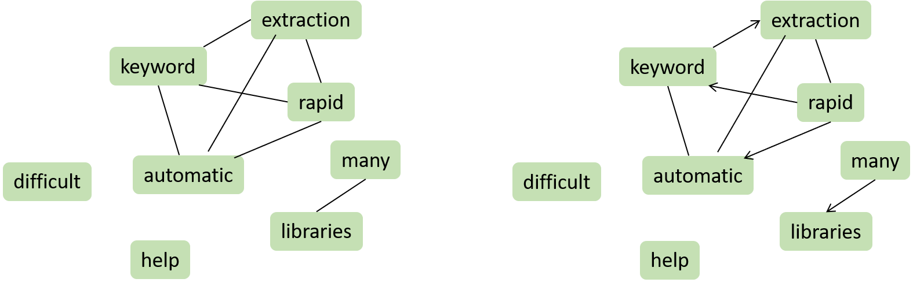

# Literature Survey

## Table of contents

1. [ Simple statistical approaches ](#1-simple-statistical-approaches)
2. [ Graph-based approaches ](#2-graph-based-approaches)
3. [ Machine Learning approaches ](#3-machine-learning-approaches)

## 1. Simple statistical approaches

Some keyword extraction methods simply rely on some statistical measures on the words or groups of words.

### Word Frequency

Word frequency consists in computing the number of occurences of each word in a document. Once this done, it is easy to find the recurrent words by taking the ones that reached the top of the frequency list. This approach does not take into account any **order** and **link** between the words, especially synonyms, even though it might be a key to understand and summarize a document. However, it may be sufficient enough to grasp the **recurrent themes** in a specific set of documents.

### Word collocations and co-occurences

Analyzing the occurence dependencies between the words in a document may be a good idea to extract its content. To that end, two notions can be used:

- **Collocations** are words that frequently go together, such as 'customer service', 'music video'. Relevant collocations are often composed of 2 (bi-grams) or 3 (tri-grams) words. More generally, the word -grams is used.
- **Co-occurences** are words that tend to co-occur: they can be adjacent or not, but always have a semantic proximity and are often used in the same context.

### TF-IDF

TF-IDF [[1]](#references) stands for **term frequency - inverse document frequency**. It is a measure of how important a word  is to a document  in a collection of documents . To define the TF-IDF, we need to define **term frequency** and **inverse document frequency**:

- The **term frequency** is the number of times  appears in  divided by the occurences of all terms in :

  

  and it can be normalized taking .

- the **inverse document frequency** measures how rare this word is in the whole collection , comparing the number of documents to the number of documents where  appears:

  

We obtain the TF-IDF by multiplying these two elements:

This measure gives insight into words that appears often in a specific document, but not in the other documents of the set. Indeed, words that are frequent in each document are often not very relevant; they are not selected with TF-IDF. But when there is only one document in , TF-IDF simply consists in choosing keyword on their frequency, which may not be bery relevant.

### RAKE

RAKE stands for Rapid Automatic Keyword Extraction. It was introduced in 2010 by _Rose, Stuart, et al. "Automatic keyword extraction from individual documents."_ [[1]](#references).

Let's consider the following text:

_Keyword extraction is not that difficult after all. There are many libraries that can help you with keyword extraction. Rapid automatic keyword extraction is one of those._

1. First, let's split the text using its **stopwords** to produce some **candidate keywords**. The text becomes 
    
    `Keyword extraction` _is not that_ `difficult` _after all. There are_ `many libraries` _that can_ `help` _you with_ `keyword extraction`. `Rapid automatic keyword extraction` _is one of those._
    
    The candidate keywords (`keyword extraction`, `difficult`...) are sequences composed of **content words** (here `keyword`, `extraction`, `difficult`...).
    
2. Splitting the text highlighted the words co-occurences. We can therefore build the **co-occurence matrix** , where  is the number of co-occurences of the content words i and j.

    |            | keyword | extraction | difficult | many | libraries | help | rapid | automatic |
    |------------|---------|------------|-----------|------|-----------|------|-------|-----------|
    | keyword    | 3       | 3          |           |      |           |      | 1     | 1         |
    | extraction | 3       | 3          |           |      |           |      | 1     | 1         |
    | difficult  |         |            | 1         |      |           |      |       |           |
    | many       |         |            |           | 1    | 1         |      |       |           |
    | libraries  |         |            |           | 1    | 1         |      |       |           |
    | help       |         |            |           |      |           | 1    |       |           |
    | rapid      | 1       | 1          |           |      |           |      | 1     | 1         |
    | automatic  | 1       | 1          |           |      |           |      | 1     | 1         |
    
3. Then, we compute a **score for each word**. This score can take various forms, such as 
    - the **degree**  of the word in the co-occurence matrix (the sum of the number of co-occurences the word has with any other context word);
    - the **frequency**  of the word (the number of occurences of the word in );
    - the ratio of degree to frequency, ;

    |           | keyword | extraction | difficult | many | libraries | help | rapid | automatic |
    |-----------|---------|------------|-----------|------|-----------|------|-------|-----------|
    | degree    | 8       | 8          | 1         | 2    | 2         | 1    | 4     | 4         |
    | frequency | 3       | 3          | 1         | 1    | 1         | 1    | 1     | 1         |
    | ratio     | 2.7     | 2.7        | 1         | 2    | 2         | 1    | 4     | 4         |

4. The word scores are then used to attribute a score to each **expression** of the text (here `keyword extraction`, `many libraries`...) by summing the scores of its words.

5. Finally, the best ranked expressions can be used to summarize the text.

_Sentence of the example was taken from [Keyword Extraction](https://monkeylearn.com/keyword-extraction/), MonkeyLearn_ [[2]](#references)

## 2. Graph-based approaches

### Building a graph

To represent a text as a graph, we can consider its words as vertices. The edges (connections between the vertices) can be labelled, for instance with the relation that those words have in the text. Edges can be **directed** (signifying a unilateral dependency between the words) or **undirected** (co-occurences for instance).

_An undirected graph (left) and a directed one (right)._

Next, we want to measure how important a word is based on the information contained in the graph and its structure. To do so, we can compute the **degree** of each vertice of the graph, being for a directed graph

where  is the number of edges whose end is  and  the number of edges starting from . For an undirected graph,  is simply the number of edges that have an endpoint in . It is then possible to normalize this number between 0 and 1 using a division by the maximum degree in the graph.

### TextRank

The TextRank algorithm was introduced in 2004 by [[3]](#references). The basic idea is to attribute a score for each vertex, as we did above, taking into account the number of in and out edges linked to it. We define the score of a vertex  by

where  is the set of vertices that point to ,  the set of vertices that  points to, and  a **damping factor**. This algorithm actually derives from Google's PageRank [[4]](#references) and implements the "random surfer model" in the field of web surfing, where a user clicks on links at random with a probability  and jumps to a completely different page with a probability . The factor  is usually set to 0.85.

Starting from arbitrary values assigned to each node in the graph, the **computation** iterates until convergence below a given threshold is achieved.

For **weighted graphs**, we only need to slightly change the equation:

## 3. Machine Learning approaches

Keyword extraction can be seen as supervised learning from a set of examples. Machine learning approaches use training examples to learn a model and apply the model to find keywords from new documents.

### Naïve Bayes

The Naïve Bayes algorithm, introduced in [[5]](#references), aims at classifying words as being a keyword or not. To infer this classification, it needs the words to have **attributes**; in the original paper, two attributes turned out to be useful to discriminate between keywords and non-keywords: the **TF-IDF score**, that we studied above, and the **distance** of the word's first appearance in the text, defined by the number of words that precede the first appearance of the word divided by the number of words in the text. This two values, although being real numbers, are then **discretized**.

If we assume that these two attributes (TF-IDF and distance) are independent, the probability that a word is a keyword given that it has discretized TF-IDF value  and discretized distance value  is

where:

-  is the probability that a keyword has TF-IDF score 
-  the probability that it has distance 
-  the probability that a word is a keyword
-  a normalization factor that makes  lie between zero and one.

and all these probabilities can be estimated by counting the number of times the corresponding event occurs in the training data.

### CRF

Conditional Random Fields (CRF) model is a probabilistic model for labeling sequence data. [[6]](#references) introduces the use of CRF for keyword extraction. Let's say we want to classify the words of a text as being a keyword or not. For a given sequential data  and its corresponding status labels , whose elements are 0 or 1, we define the **conditional probability** as

where:

-  is a normalization factor that makes the probability of all state sequences sum to 1
-  is a feature function
-  is a learnt weight associated with feature 

To train a CRF, one can use the maximum entropy learning algorithm. We determine the most probable label sequence by

### References

**[1]**&emsp;Ramos, Juan. _"Using tf-idf to determine word relevance in document queries."_ Proceedings of the first instructional conference on machine learning. Vol. 242. 2003.\
**[2]**&emsp;_"Keyword Extraction: A Guide to Finding Keywords in Text."_ Monkeylearn, [https://monkeylearn.com/keyword-extraction/](https://monkeylearn.com/keyword-extraction/)\
**[3]**&emsp;Mihalcea, Rada, Paul Tarau, and Elizabeth Figa. _"PageRank on semantic networks, with application to word sense disambiguation."_ COLING 2004: Proceedings of the 20th International Conference on Computational Linguistics. 2004.\
**[4]**&emsp;Brin, Sergey, and Lawrence Page. _"The anatomy of a large-scale hypertextual web search engine."_. 1998.\
**[5]**&emsp;Wu, Yi-fang Brook, et al. _"Domain-specific keyphrase extraction."_ Proceedings of the 14th ACM international conference on Information and knowledge management. 2005.\
**[6]**&emsp;Zhang, Chengzhi. _"Automatic keyword extraction from documents using conditional random fields."_ Journal of Computational Information Systems 4.3 (2008): 1169-1180.\
